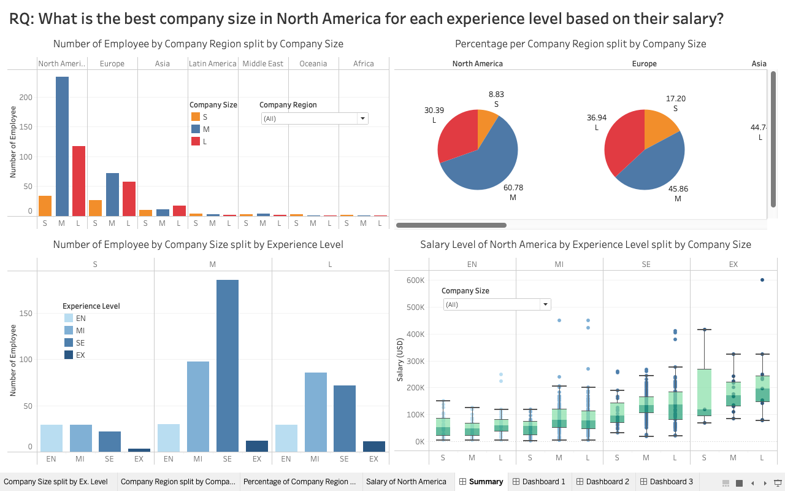
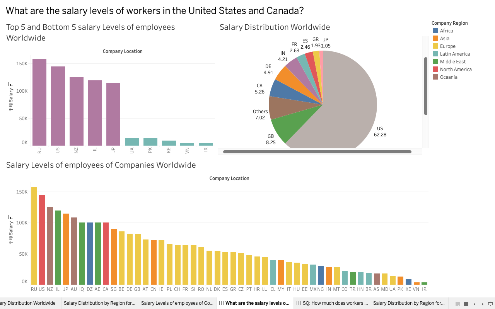
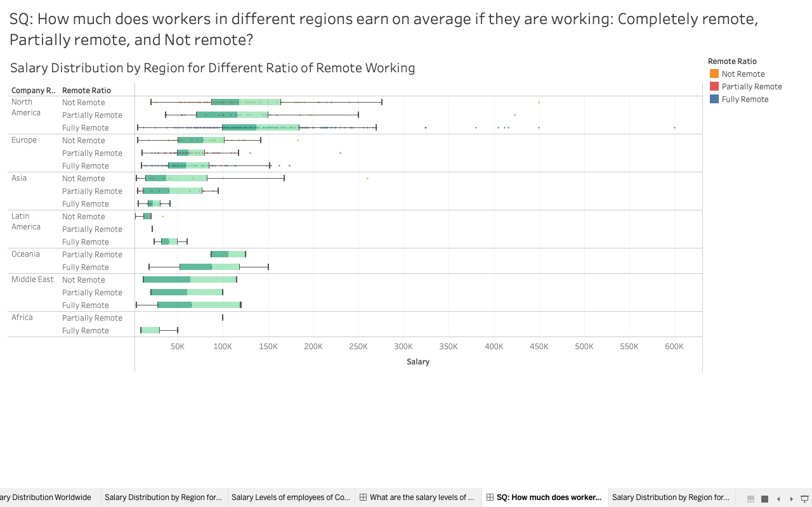
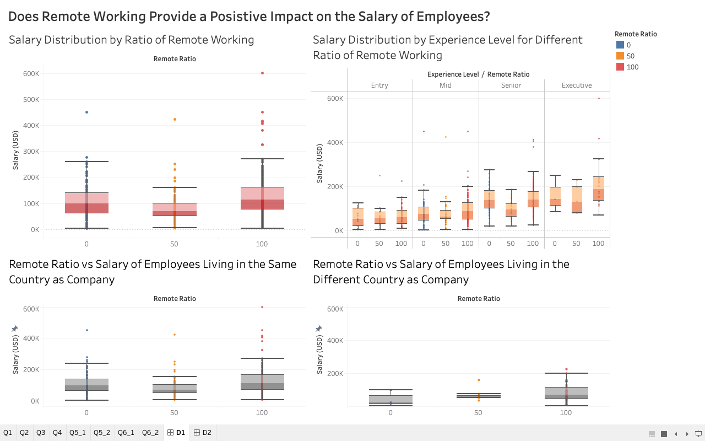
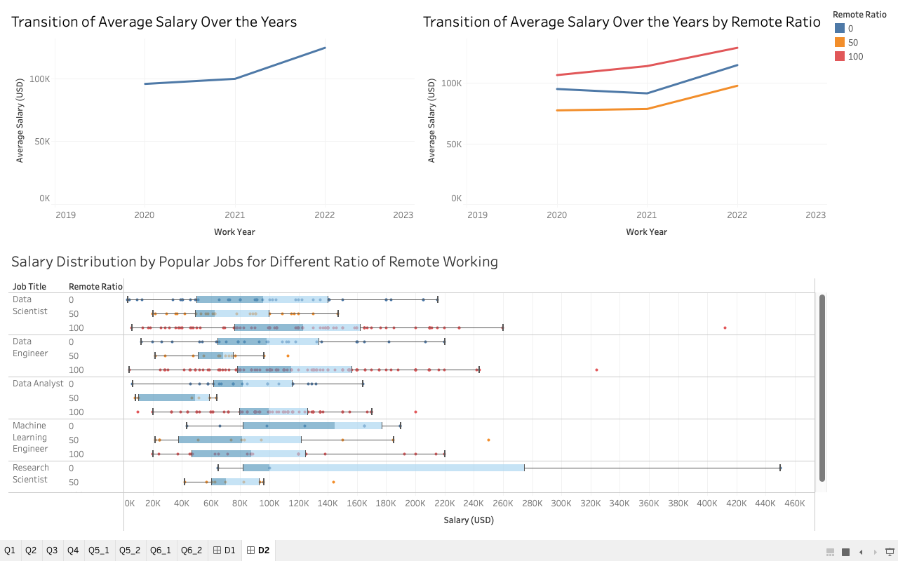

# Group 07 - Optimization of Data Scientist's Job Field
This is a project from DATA301.  
This project is a group analysis of salary data.
For more detail, refer to the [presentation video](https://youtu.be/wX8M58ygBF8 'DATA301 Salary Analysis Presentation'). 

## Milestones

Milestone 1: In this milestone you will be expected to choose a dataset appropriate for the DATA 301 project. The most important task for this milestone is to select an appropriate dataset.

Milestone 2: In this milestone you will be expected to explain your dataset (source, columns, general explanation of your dataset) and come up with research questions.

Milestone 3: In this milestone you will be expected to process and clean your dataset, do exploratory data analysis (EDA).

Milestone 4: In this milestone you will be expected to create some data visualizations, and work with method chaining in Pandas. 

Milestone 5: In this milestone you will be finalizing your submission and presenting all your hard-work to your fellow students as a Dashboard.

## Describe your topic/interest in about 150-200 words

Our overall interest is the optimization of our job style for the future to earn a higher salary through analysis of salary data of workers in data science related fields. To break down this huge question into smaller pieces, we have formed our research questions based on our individual interest in this dataset. 
One of them is the effectiveness of remote working. Remote working is one of the huge advances produced by modern technology, but its effectiveness is still under research. Through this research, we may produce the relevance of salary and remote working, and moreover, acknowledgement about the skill we should gain before working in industries in order to be better adapted to remote working.
Second one is the different salary levels based on the company size. We are interested in this because as data science students, we want to gain insight into different salary levels for each company size so that it will help me when choosing my career path.
Lastly, our team would also like to see how salary levels differ in different countries. Although several factors contribute to how much a worker is paid, we would like to see which countries pay a worker more than the other. This information could benefit many data science major students, providing them with examples of career paths in different countries. 

## Describe your dataset in about 150-200 words

This dataset consists of various information in relation to different data science jobs including their work year, experience level, employment type, job title, salary in different currencies, employee residence, and the remote ratio. Our team has cited this dataset from Kaggle, and the data is collected from 2020 to 2022. It was collected by a dataset grandmaster on kaggle. The purpose of the data collection was not mentioned within the dataset. 
Our overall speculation of this dataset is that several factors, such as company location and the size of the company influence the salary level. Specifically, our team formed an assumption that certain locations of the company positively influence the salary level. We also conjecture that the company size and the salary level has a positive relationship. In contrast, we forecast that there are factors that have an indirect relation to salary such as remote working. 

## Team Members

- Taii: I like volleyball
- Koko: I like cats
- Yuki: I like rugby

## Images

### Dashboard 1

### Dashboard 2

### Dashboard 3

## References

https://www.kaggle.com/datasets/ruchi798/data-science-job-salaries

