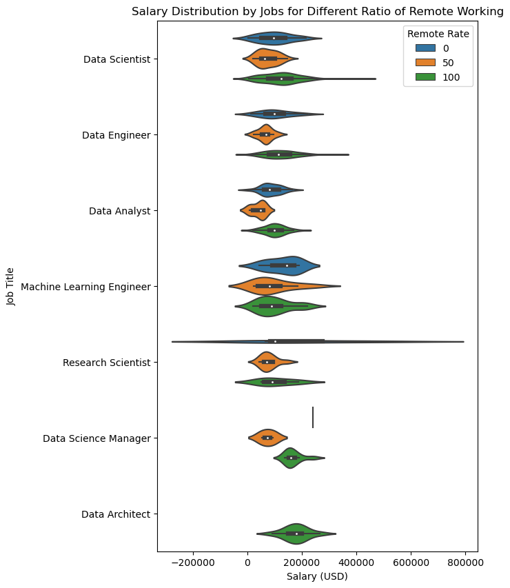

# Final Report - Group 07

## **Introduction**

Our project aims to analyze optimized job styles for the future to earn a higher salary through the analysis of salary data of workers in data science related fields. With the increasing demand for data science professionals, it's essential to understand the factors that influence salary levels, such as remote working, company size, and location. Our team believes that this project is important as it can provide valuable insights into career paths and help students make informed decisions about their future. We are excited to explore the data and test our hypotheses about the various factors that influence salary levels in the data science field. Our project is based on a dataset from Kaggle, collected from 2020 to 2022, and includes information on work experience, employment type, job title, salary, employee residence, and remote ratio. We hope that our findings will contribute to the overall understanding of the data science job market and inform future career decisions.

## **Exploratory Data Analysis**

For each research question, we have three different highlights.  

- We utilized violinplot to illustrate the correlation among salary, experience level, and company size, enabling us to accurately display the distribution of salaries for workers at each experience level.
- For the second research question, we utilized barplots to effectively illustrate the varying salary levels across different continents. Additionally, we incorporated a pie chart to indicate the distribution of data among different countries and to demonstrate the dataset's strong bias towards the United States.
- To visualize the salary distribution for different experience levels of workers by ratio of remote working, we have used a box plot so that the more precise tendency in effectiveness of remote working for each level is better readable.  

## **Research Question 1 and Results: What is the best company size in North America for each experience level based on their salary?**

- Full analysis notebook: [link](https://github.com/ubco-W2022T2-data301/project-group-group07/blob/main/analysis/analysis1.ipynb)

To address this research question, I divided it into three sub-questions.

### *1.1: Which experience level workers are hired in each company size?*

Firstly, I investigated the distribution of experience levels for each company size.  

The results showed that medium-sized companies had the largest number of employees overall. In large-sized companies, mid-level experience workers were most commonly hired, followed by senior-level workers. For medium-sized companies, senior-level workers were the most commonly hired. Small-sized companies tended to hire entry-level and mid-level workers in almost equal numbers.

### *1.2 How are the each company size distributed over the region and which level of company size do they tends to have?*

Next, I explored the distribution of company size across different regions.

The data showed that in North America and Europe, medium-sized companies were the most common, while in Asia, large-sized companies were more prevalent. In other regions, such as Latin America and the Middle East, there appeared to be more small-sized companies.

### *1.3 What is the difference in salary level by experience level for each company sizes in North America?*

Finally, I focused on the North American region and analyzed the salary distribution across experience levels and company sizes.  

The above plot revealed that as the experience level increased, so did the salary range, with the most common range for entry, middle, and senior-level employees being between $100,000 and $200,000 US Dollars. Moreover, salaries tended to increase as the company size grew, except for expert-level employees who had a wider salary range, particularly in small-sized companies.

In conclusion, based on the results, I recommend medium-sized companies in North America for entry, middle, and senior-level employees, while expert-level employees may consider starting their own business for the potential to earn more.

## **Research Question 2 and Results: What are the salary levels of workers in the United States and Canada?**

- Full analysis notebook: [link](https://github.com/ubco-W2022T2-data301/project-group-group07/blob/main/analysis/analysis2.ipynb)

I have added few sub questions in relation to my main research question:  

- In comparison to workers in these North American countries, how much do workers in other countries earn?  
- What are the salary levels of workers in other continents like Asia, Europe, Latin America, and Africa?
- How much does workers in different regions earn on average if they are working: Completely remote, Partially remote, and Not remote?

The analysis of the salary data from the dataset revealed interesting insights into the salary levels of workers in different countries, including the United States and Canada. The average salary level in United States was approximately $144,000. In contrast, the average salary level in Canada was approximately $100,000. Thus, the difference in salary level was approximately $44,000.

In comparison to the two North American countries above, this graph showed that workers in Russia earn the highest salaries, amounting to approximately $160,000. The second highest was the United States, followed by New Zealand at $125,000. Overall, European countries tended to be in the mid-level range, while Asian countries were distributed equally throughout the graph. One key point about this observation is that Japan and Singapore are on the highend of salary level, but countries like Vietnam and Pakistan are on the lowend.  

Therefore, this observation can indicate how third-world countries tend to pay their workers less than first-world countries. This indication is further demonstrated by the salary levels in Latin American countries compared to Oceanian countries like New Zealand and Australia.  

However, it's worth noting that the dataset is heavily skewed towards the United States, with 62% of the data coming from the US. Despite categorizing all countries with 5 or less data as "Others", this still counted for only 7 percent of the entire dataset.  

As for the sub-question of the effect of remote work on salary levels in different regions, the plot showed that the impact varies by region.  

In Europe and North America, a combination of in-person and remote work results in the lowest salary levels, while in Asia, both in-person and partially remote work result in better salary levels than full remote work. The limited data from other regions makes it challenging to draw firm conclusions on this topic.  

In conclusion, with the assumption that this dataset is heavily skewed towards the United States, it can be said that United States offers the highest average salary levels, and therefore, would be recommended for other data science students to find a job in the United States.  

## **Research Question 3 and Results: Does Remote Working Provide a Positive Impact on the Salary of Employees?**

- Full analysis notebook: [link](https://github.com/ubco-W2022T2-data301/project-group-group07/blob/main/analysis/analysis3.ipynb)

The COVID-19 pandemic has brought attention to the advantages of remote work. However, recent studies suggest that the effectiveness and productivity of remote work largely depend on individual workers' skills.  
In this research project, I analyzed the correlation between the ratio of remote work and the salary and in which condition it works more effectively. This analysis is under the assumption that a higher salary indicates better job performance. Although salary alone is not an absolute measure of success, as there are limited criteria in this dataset, I used it as a clear indicator of job success.  

### *3.1 Correlation of Remote Working and Salary in General*

This is the plot of salary distribution by ratio of remote working.  
Referring to the plot, utilizing both remote and in-person working methods appears to be the least favorable option. This observation is mostly consistent throughout the analysis with additional conditions.  
There also is not a significant contrast between solely working in-person or remotely.  

### *3.2 Workers' Experience Level*

This is the plot of salary distribution for different experience levels of workers by ratio of remote working.  
To begin with, using a combination of in-person and remote working resulted in the lowest productivity regardless of experience level, as previously observed in plot in *3.1*. Furthermore, as experience level increases, the salary gap between partial remote and full remote becomes more significant.  
However, for Executive-level experienced workers, the disparity between working fully in-person or fully remote is noticeable, indicating a clear advantage to remote work.  

### *3.3 Type of Jobs*

This is the plot of salary distribution for different jobs by ratio of remote working.  
To avoid insufficient data, I have selected several jobs with more than 10 workers to compare them through plots since it is challenging to categorize jobs without knowing their precise duties.  
Based on the plot, the effectiveness of remote work varies by job. Jobs such as Data Scientist, Data Engineer, and Data Analyst are similar, and their distributions are alike. These three jobs also represent 61.29% of the total data, which results in a homogeneous shape in the plot similar to plot in *3.1*.  
However, Machine Learning Engineer, Research Scientist, and Data Science Manager exhibit a property where full in-person work provides better advantages than full remote work, which is inconsistent with *3.1*. Nonetheless, it's crucial to note that these jobs have relatively less data.  
In the case of Data Architect, there is a lack of data, and all workers belong to full remote work, making it impossible to evaluate its effectiveness.  
Overall, the efficacy of remote work varies among jobs, but it's difficult to identify similarities due to limited data sources.  

### *3.4 Region*

This is the plot of salary distribution for different regions by ratio of remote working.  
According to the plot, the effectiveness of remote work appears to be unique to the region. In Europe and North America, the shape of the plots is very similar to plot in *3.1*. The combined use of in-person and remote work yields the worst productivity, and full in-person and full remote work exhibit negligible differences. However, this occurs because the sum of them represents 89.29% of the total data.  
Conversely, in Asia, full in-person work and the combined use of in-person and remote work are considerably more effective than full remote work. The cause of this phenomenon cannot be analyzed, but it is an intriguing property worth noting.  
In the other remaining regions, the data is not accurate enough to analyze.  

### *3.5 Transition Over the Years*

This is the plot of the transition of average salary over the years.  
This plot reveals a consistent trend in which the average salary of data scientists increases over the years, regardless of the remote working ratio. There are three major factors that could impact the average salary of data scientists.  

- The COVID-19 pandemic caused significant damage to the economy in 2020, but it has gradually recovered since then.  
- Data science is a profession that may not necessarily require in-person work, which could mean that the average salary of data scientists is less negatively affected than other professions.  
- sThe economy in general tends to grow gradually, meaning that the average salary of data scientists should increase even without completely recovering from the COVID-19 damage.  

This is the plot of the transition of average salary over the years by ratio of remote working.  

Following precedent, the combination of in-person and remote work tends to result in the worst productivity, as shown in the analysis *3.1*.  
Based on the plot, it appears that the average salary of full in-person jobs decreased in 2021, which is an intriguing finding. It is possible that this was caused by some companies going out of business that year. In contrast, companies that had adopted remote working may have been able to avoid bankruptcy. However, due to the limited range of data available (only from 2020 to 2022), it is difficult to draw a definitive conclusion about the underlying causes of this phenomenon.  

### *3.6 Same and Different Locations as Company*  

These are the plot of salary distribution by ratio of remote working when employees are living in the same and different countries as the company.  
The plots suggest that remote working is more beneficial for employees residing in different countries than those residing in the same country as their company. The group of first plot accounts for 91.6% of the data, showing that there is not much difference between full in-person and remote working when employees have an option to work in-person. However, for employees without an option to work in-person, more remote working appears to result in better productivity. Due to limited data in the group of second plot, the reliability of the second plot may be lower than the first plot.  

### *Summary*  

Following are the summary of the analysis about effectiveness of remote working under various conditions.  

- Partial remote working is generally the worst option.
- Experienced workers tend to benefit more from remote working.
- Remote working can increase the salary of employees if they live in a different country than their company.
- Effectiveness of remote working varies by job.  

## **Conclusion**

In conclusion, based on the analysis, medium-sized companies in North America appear to be a favorable option for entry, middle, and senior-level employees. However, expert-level employees may want to consider starting their own business for the potential to earn more. Additionally, the dataset heavily favors the United States, which offers the highest average salary levels, making it an attractive destination for data science students to find a job. As for remote working, the effectiveness varies by job, and experienced workers tend to benefit more. Partial remote working is generally the least favorable option. Interestingly, remote working can also increase an employee's salary if they live in a different country than their company. Overall, individuals should consider their specific situation and preferences when deciding on the best working arrangement for them. As for all the university students in the data science field, on the premise that these students are actively seeking for a job in this industry, and they are low-skilled data scientists, we suggest to enter the job market in the United States at a mid-sized companies and to avoid partially remote jobs.  
